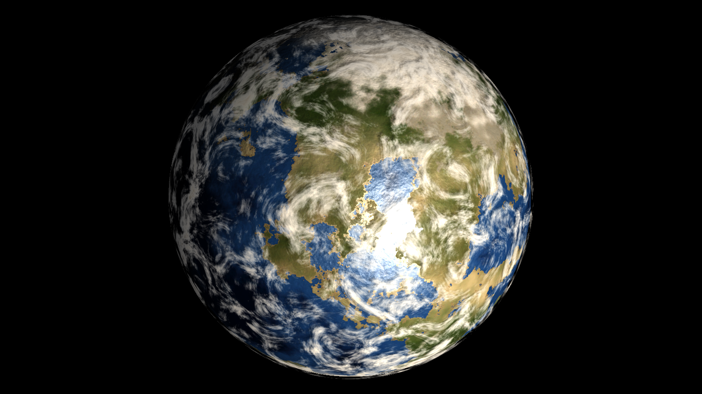
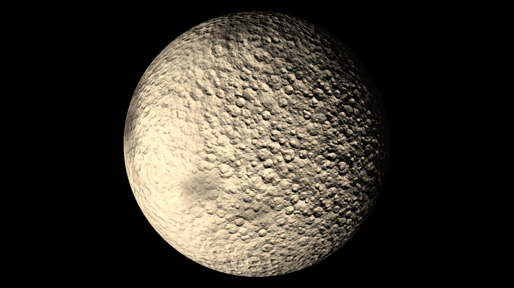
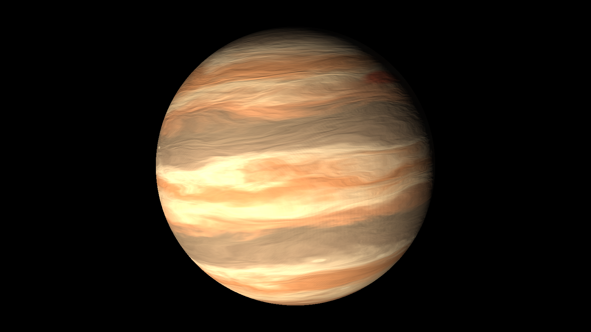
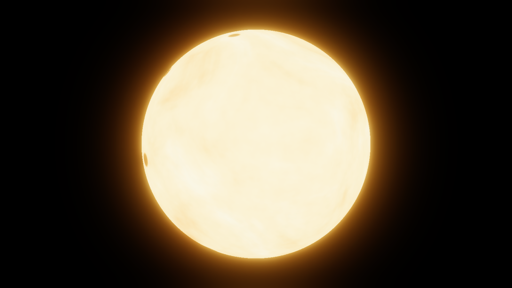
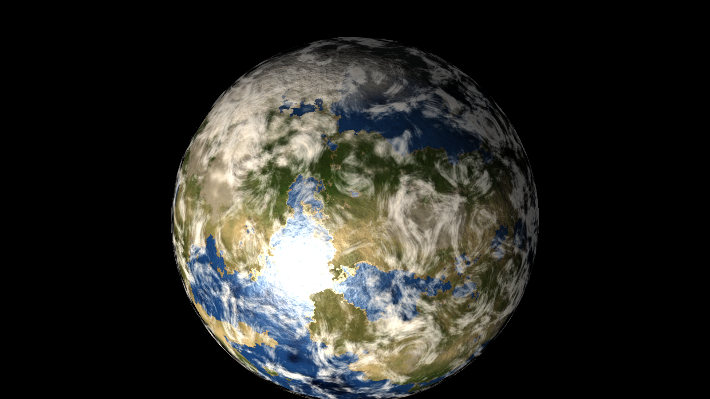
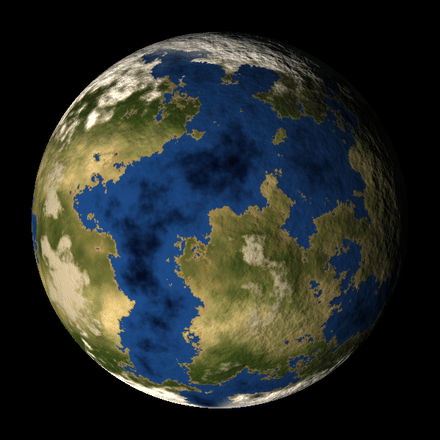
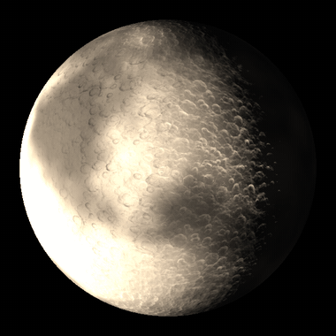
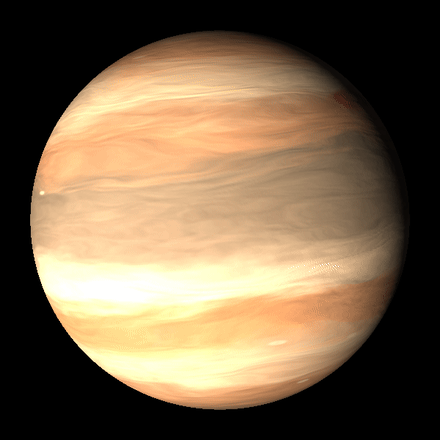
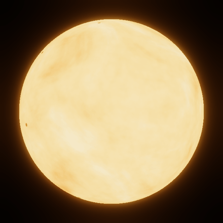

# Planet Generator

Editor tool for Unity URP that generates planet & star prefabs at design time.
Each planet ships as a self-contained set of cubemap PNGs, materials, and a
ready-to-drop prefab. No runtime cost — generation happens once, you keep the
result as a regular asset.



<p align="center">
  
  
</p>
<p align="center">
  
  
</p>

<sub>Every image is a preset generated by the tool (GPU or CPU backend, 1024&nbsp;cubemaps),
exported as a drop-in LOD prefab — terrestrial, rocky, gas giant, star.</sub>

<p align="center">
  
  
</p>
<p align="center">
  
  
</p>

<sub>Every slider re-bakes the preview live. Clockwise from top-left:
**Sea Level**, **Relief**, **Sunspot Size**, **Band Count** — one preset per
body type, seed fixed throughout each sweep.</sub>

## Requirements

- Unity **6000.0.61f1** (Unity 6.0 LTS) or later — this is the version the
  asset was developed and tested on.
- Universal Render Pipeline installed and active.
- For the CPU backend: Burst + Collections + Mathematics packages (Package
  Manager → Unity Registry). These are part of Unity's standard package set;
  most projects already have them.

## Opening the tool

`Window → Planet Generator`

The tool spawns a hidden preview sphere in the active scene. Make sure the
scene has a **Directional Light** for proper preview shading.

## Generator modes

| Mode | Output |
|------|--------|
| **Terrestrial** | Continents, oceans, beaches, biomes (desert/grass/forest), mountains, polar caps, clouds |
| **Rocky** | Airless surface with mare plains, regolith, optional polar ice, and a user-supplied tileable **detail texture** (e.g. real asteroid photo) mapped triplanar onto the sphere |
| **Gas Giant** | Latitude bands, zonal flow + curl, storm ovals (big + small), pole darkening |
| **Star** | Photosphere with granulation, sunspots, HDR emission for bloom |
| **Debug Noise** | Visualizes the underlying 3D fBm — useful for tuning |

## Workflow

1. Choose mode, tweak sliders — the preview updates live.
2. `Randomize Seed` for variations of the same parameter set.
3. Set `Name` and `Export Resolution` (1024–2048 recommended).
4. Click `Save Planet`. The tool writes:

```
Assets/Procedural Planets Generator/Library/{Name}/
├── Textures/
│   ├── color.png       (RGB biome + A height — imported as Cubemap)
│   ├── normal.png      (object-space normal map)
│   └── cloud.png       (RGB tint + A density, terrestrial only)
├── Materials/
│   ├── {Name}_Body.mat   (Valtiel/Planet/Surface)
│   └── {Name}_Clouds.mat (Valtiel/Planet/Clouds, terrestrial only)
├── {Name}.prefab         (drag-and-drop ready)
└── params.json           (round-trippable via Load Planet)
```

5. Drag the prefab into any URP scene. Lit by your scene's directional light
   and ambient — no setup required.

## How the no-pole-pinching works

Standard equirectangular textures pinch at the poles because the UV
parameterization stretches there. Instead, this asset:

- Generates **cubemaps** (6 faces, seamless at edges).
- Uses a **custom URP Lit shader** (`Valtiel/Planet/Surface`) that samples
  the cubemap by **object-space normal** rather than UV. Every point on the
  sphere maps to a unique direction → a unique texel. No pinching, no seams.
- The mesh is a **quad-sphere** (cube subdivided then normalized) so vertex
  positions and normals are well-distributed.

The shader is otherwise URP Lit-equivalent: main light + additional lights +
shadows + GI + fog all work normally.

## Shared assets

LOD meshes live at `Assets/Procedural Planets Generator/Meshes/`. They're shared
across all generated planets — one mesh allocation in GPU memory regardless
of how many planets you generate.

## Reproducibility

`params.json` contains the seed and every slider value. Re-loading the JSON
and re-exporting produces a bit-identical result on the same machine (modulo
algorithm changes). For cross-machine determinism (DX11 vs Vulkan etc.),
ship the exported PNG textures themselves, not just the JSON.

## Backend selection (GPU vs CPU)

The generator ships with **two interchangeable backends** selectable from
the top of the editor window:

| Backend | Speed (512² cubemap) | Platform support |
|---------|----------------------|------------------|
| **GPU** | 1–5 ms per regen | DX11+ / Vulkan / Metal / WebGPU. **Not** WebGL 2.0. |
| **CPU** | 50–300 ms per regen | Every platform Unity targets. |

The CPU path uses Burst-compiled Jobs (`Unity.Burst`, `Unity.Collections`,
`Unity.Mathematics`). Visual output matches the GPU path within float
precision. Choose **CPU** if your dev machine doesn't support compute
shaders or for guaranteed cross-platform identical output. Choose **GPU**
otherwise — it's an order of magnitude faster for live slider-tweaking.

## License

[MIT](LICENSE.md) — free to use, modify and redistribute, including in
commercial projects. Just keep the copyright notice and license text.

© 2026 Fabien Boco
